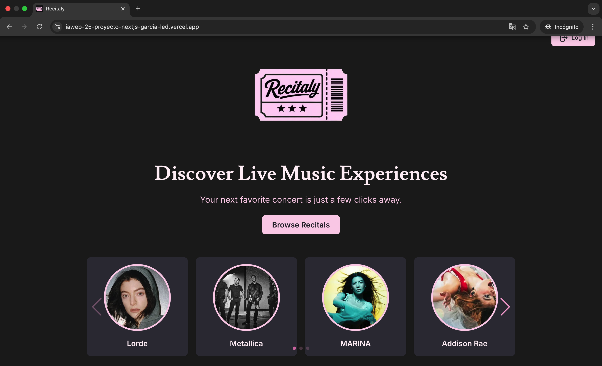
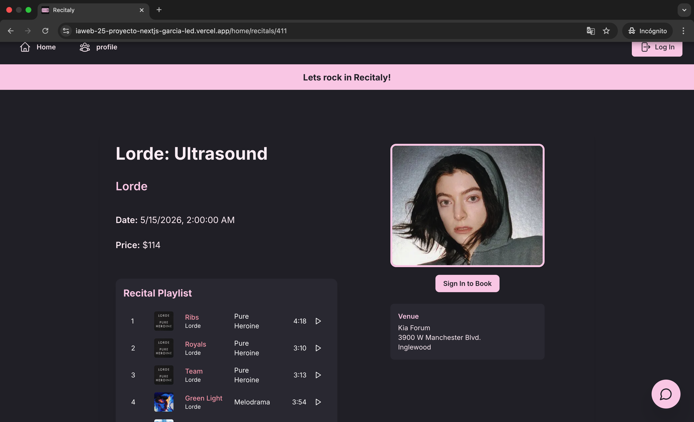
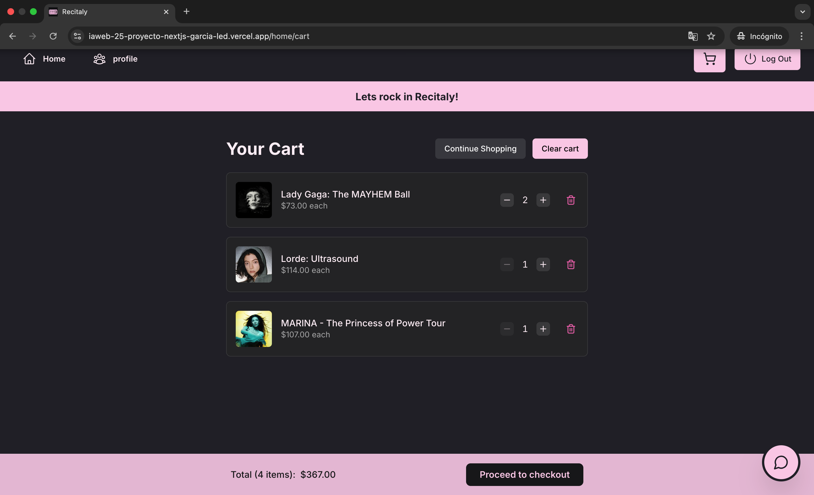

# 🎵 Recitaly — Concert Booking Platform

Aplicación web full-stack para la exploración y compra de entradas a recitales, desarrollada con **Next.js**, **PostgreSQL** y **Mercado Pago**.

🔗 **Live Demo:** https://iaweb-25-proyecto-nextjs-garcia-led.vercel.app

---

## ✨ Features

* 🔍 Búsqueda de recitales por artista y fecha
* 🎟️ Compra de entradas con integración de pagos (Mercado Pago - sandbox)
* 👤 Autenticación de usuarios
* 📅 Visualización de eventos y detalles completos
* 🧾 Historial de reservas del usuario
* 🤖 Chatbot integrado (IA) para asistencia
* 🛠️ Panel de administrador para gestión de datos

---

## 🧱 Tech Stack

**Frontend**

* Next.js
* React
* Tailwind CSS

**Backend**

* API Routes (Next.js)
* Node.js

**Base de Datos**

* PostgreSQL

**Autenticación**

* NextAuth / JWT

**Pagos**

* Mercado Pago (Checkout Pro - Sandbox)

**Otros**

* Integración con API externa
* Chatbot con IA (Gemini)

---

## 🔐 Demo Accounts

### 👤 Usuario

* Email: `chicken@mail.nya`

* Password: `miau`

* Email: `catlover@mail.com`

* Password: `secret123`

### 🛠️ Admin

* Email: `admin@example.com`
* Password: `chicken`

---

## 💳 Mercado Pago (Sandbox)

**Comprador de prueba**

* Usuario: `TESTUSER313683539`
* Password: `ncsbabYX73`

**Tarjeta**

* Número: `5031 7557 3453 0604`
* CVV: `123`
* Exp: `11/30`
* DNI: `12345678`

---

## 🖼️ Screenshots

### inicio

Inicio


### Detalle del recital

Información completa + playlist


### Carrito de compras

Carrito 


---

## ⚙️ Instalación local

```bash
# Clonar repo
git clone https://github.com/candela-ledesma/recitaly-ticketing-platform.git

# Instalar dependencias
npm install

# Variables de entorno
cp .env.example .env

# Ejecutar
npm run dev
```

---

## 🖼️ Screenshots

### Bienvenidos

Welcome page


### Detalle del recital

Información completa + playlist


### Carrito de compras

Shopping cart


---

## 📌 Variables de entorno

Ejemplo:

```
DATABASE_URL=
NEXTAUTH_SECRET=
MERCADOPAGO_ACCESS_TOKEN=
```

---

## 🧠 Decisiones de diseño

* Se requiere login para comprar entradas → permite persistir reservas
* Separación clara entre usuarios y administradores
* UI enfocada en experiencia tipo “Spotify / Ticketing”
* Integración de IA como valor agregado (chatbot)

---

## 🚧 Mejoras futuras

* Sistema de recomendaciones personalizadas
* Notificaciones de eventos
* Filtros avanzados (género, ubicación, precio)
* Deploy con base de datos productiva

---

## 👩‍💻 Autores

* Garcia Romina
* Ledesma Candela

---

## 📄 Licencia

Este proyecto fue desarrollado con fines académicos.
